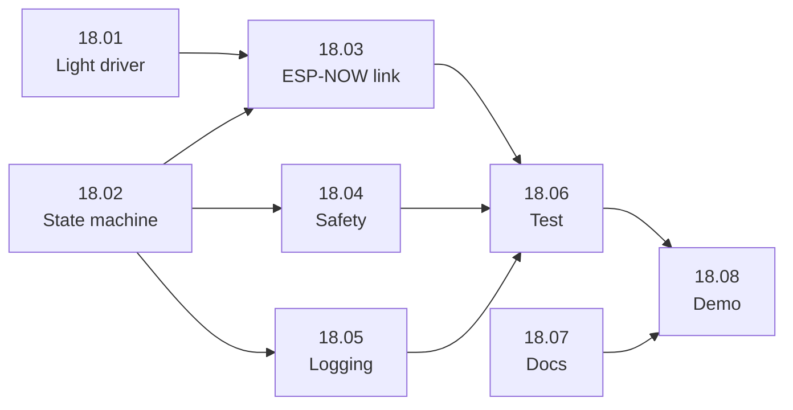

# Sprint 2

Planning, progress and outcome of sprint 2. The backlog itself is maintained in Trello;
this document records what the team committed to and what was delivered.

---

## 1. Overview

| | |
|---|---|
| **Period** | *(start date – end date)* |
| **Sprint goal** | A safe fixed-time traffic control runs on the hardware setup: the master runs the cycle and switches the lights on the slave over ESP-NOW. |
| **Review / demo date** | *(date)* |

This sprint delivers the **baseline**: a classic fixed-time cycle without detection.
It is the first time master and slave work together as a traffic light, and it is the
regulation the smart regulation is compared with later (US-16). Everything adaptive
(detection, priority, dashboard) comes in later sprints.

## 2. Selected user stories

Stories pulled from the backlog for this sprint. Acceptance criteria live in
[`functional-design.md`](../functional-design.md); for US-18 they are on the Trello
task cards (see section 3).

| Story | Epic | Title | MoSCoW | Owner | Status |
|---|---|---|---|---|---|
| US-18 | E1 | A simple traffic control: *as a traffic controller I want a fixed-time base regulation on the Oranjesingel, so traffic is handled safely and the smart regulation can be compared with it* | Must | *(name)* | To do |

## 3. Tasks

US-18 is split into eight tasks. The first four build the regulation, task 5 makes it
measurable, and tasks 6–8 test, document and present it.

| Task | Story | Owner | Status |
|---|---|---|---|
| US-18.01 Light driver on the slave | US-18 | *(name)* | To do |
| US-18.02 Fixed-time state machine on the master | US-18 | *(name)* | To do |
| US-18.03 ESP-NOW link master → slave | US-18 | *(name)* | To do |
| US-18.04 Safe start-up and conflict guard | US-18 | *(name)* | To do |
| US-18.05 Serial logging of phase changes | US-18 | *(name)* | To do |
| US-18.06 Test plan and test report sprint 2 | US-18 | *(name)* | To do |
| US-18.07 Update technical design and README | US-18 | *(name)* | To do |
| US-18.08 Prepare sprint 2 demo | US-18 | *(name)* | To do |

### Order of work

18.01 and 18.02 can be built in parallel, because the slave and the master are
separate firmwares. 18.03 depends on both. Documentation (18.07) can run alongside
the whole sprint.

### What each task must deliver

Copied from the acceptance criteria checklists on the Trello cards.

**US-18.01 Light driver on the slave:** code on the slave that switches a signal group
(main road / side road) to red, orange or green.
- One function sets a signal group to red, orange or green
- Only one colour per signal group is on at a time
- Each LED is verified with a small test sketch
- Pin numbers are defined in one place (config), not scattered through the code

**US-18.02 Fixed-time state machine on the master:** the fixed-time cycle as a state
machine.
- Cycle order: main green → main orange → all red → side green → side orange → all red → repeat
- Non-blocking: uses `millis()`, no `delay()`
- All phase durations are constants in one config file
- Cycle keeps running correctly for at least 10 minutes

**US-18.03 ESP-NOW link master → slave:** the master sends the current phase to the
slave, and the slave switches its lights.
- Message format (struct) for a phase command is defined and shared by master and slave
- Master sends the phase on every phase change
- Slave switches its lights to the received phase
- Slave confirms receipt; master logs a failed delivery

**US-18.04 Safe start-up and conflict guard:** the intersection can never show a
dangerous combination of lights.
- System boots in all red before the first cycle starts
- Main road and side road can never be green (or orange) at the same time; this is checked in code
- There is always an all-red clearance phase between the two directions

**US-18.05 Serial logging of phase changes:** every phase change is logged over serial,
so the fixed-time regulation can serve as the baseline for US-16.
- Each phase change is logged with a timestamp and the new phase
- Log format is consistent and easy to copy into a file (e.g. CSV-style)

**US-18.06 Test plan and test report sprint 2:** how the fixed-time regulation is
tested, and the results.
- Test cases written for: cycle order, phase durations, all-red clearance, start-up behaviour, lost master-slave connection
- All test cases executed on the hardware setup
- Results (pass/fail + findings) recorded in `docs/`
- Failed tests are turned into cards for the next sprint

**US-18.07 Update technical design and README:** the fixed-time regulation documented
in the repository.
- State diagram of the cycle added to [`technical-design.md`](../technical-design.md)
- Timing table (duration per phase) added
- Pin mapping of the existing wiring documented
- ESP-NOW message format described
- README explains how to build and upload master and slave

**US-18.08 Prepare sprint 2 demo:** the sprint review demonstration.
- Working fixed-time cycle can be shown on the hardware setup
- Short demo script: sprint goal, what is shown, results, known issues
- Division of who presents what is agreed within the team

### Starting point and points of attention

- **Already available:** the ESP-NOW practice sketches (`src/basics/espnow_master/`,
  `src/basics/espnow_slave/`) prove that master and slave can exchange messages and
  contain the callback code for both Arduino core versions. 18.03 can build on them.
  The board MAC addresses are already in `lib/VriConfig/VriConfig.h`.
- **Technical design:** the draft technical design (PR #9) already describes a state
  diagram, the ESP-NOW message format and a proposed pin mapping. For 18.07 these
  need to be brought in line with what is actually built for the fixed-time cycle.
- **Phase durations are not defined yet.** The functional design gives minimum and
  maximum green times, yellow (3 s) and clearance (2 s), but no fixed green time per
  direction. Agree on these values before 18.02 and record them in
  [`decisions.md`](../decisions.md).
- **US-18 is not in the functional design yet.** The story only exists in Trello; add
  it to the user story table in [`functional-design.md`](../functional-design.md).
- **Fail-safe is out of scope.** The test plan covers a lost master-slave connection,
  but switching to flashing yellow (US-02, BR-05) is not a Sprint 2 task. The test
  should record what happens now, so the result can feed into the next sprint.

## 4. Progress

Short notes from the daily stand-ups: what changed, blockers, decisions.

| Date | Notes |
|---|---|
| *(date)* | *(notes)* |

## 5. Blockers and impediments

Everything that stopped or slowed down work during this sprint: what happened, why it
could not go ahead, and what was done about it.

| Date | Story / task | What was blocked | Cause | Action taken | Status |
|---|---|---|---|---|---|
| *(date)* | US-xx | *(what could not go ahead)* | *(why: hardware, knowledge, dependency, time, ...)* | *(what was done or who was asked)* | Open / Solved |

## 6. Sprint review

### Delivered

- *(story / feature that is Done)*

### Not delivered

Stories that were not finished. Explain why, and refer to the blocker in section 5
when there is one.

| Story | Why it was not finished | Moves to |
|---|---|---|
| US-xx | *(reason)* | Sprint 3 / backlog |

### Demonstration

*(what was shown to the client and how)*

## 7. Client feedback

Feedback received during the review. Follow-up is recorded in
[`client-feedback.md`](../client-feedback.md).

- *(feedback)*

## 8. Retrospective

| What went well | What could be better | Action for next sprint |
|---|---|---|
| *(item)* | *(item)* | *(action + owner)* |
