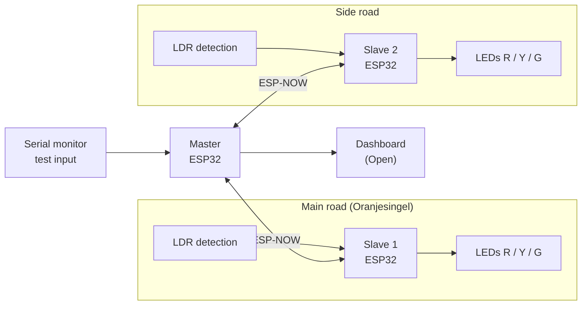
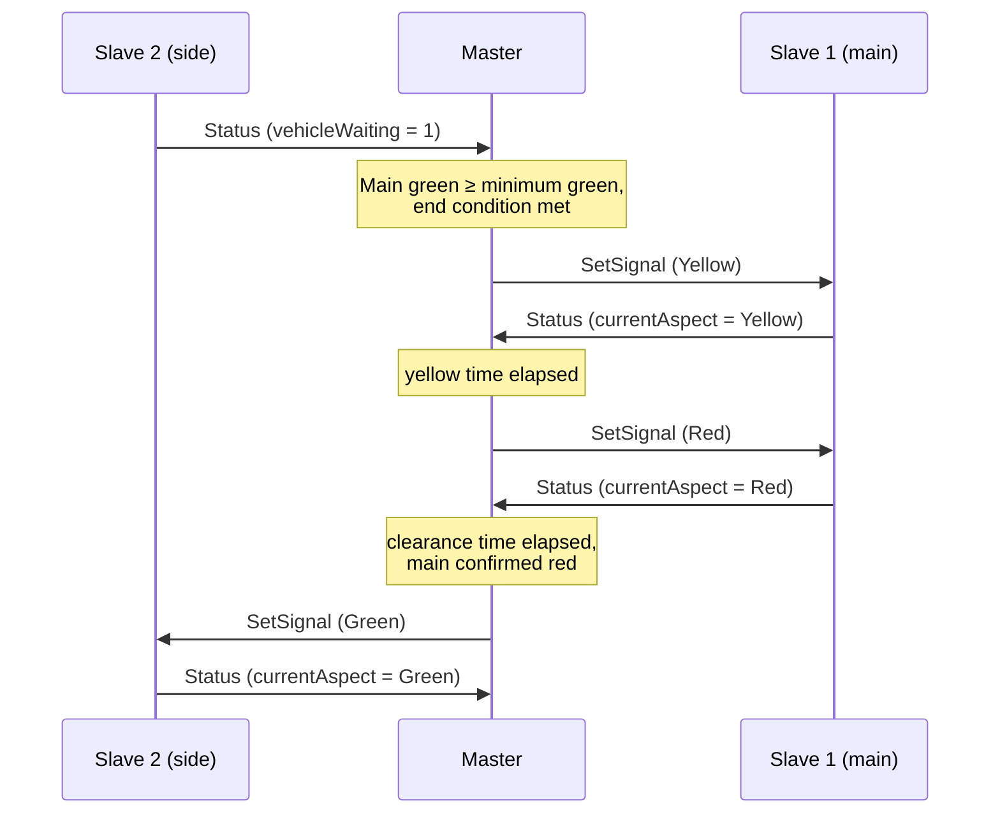

# Technical Design

How the smart traffic control prototype is built. What the system does is described in
[`functional-design.md`](functional-design.md); this document explains how the
architecture, communication, control logic and data model realise it. The reasoning
behind individual choices is recorded in [`decisions.md`](decisions.md).

> **Status: draft.** Sections and values marked **Proposed** are a starting point for
> discussion. Items marked **Open** still need a team decision and are collected in
> [section 9](#9-open-decisions).

---

## Contents

1. [Architecture](#1-architecture)
2. [Hardware](#2-hardware)
3. [Communication (ESP-NOW)](#3-communication-esp-now)
4. [Control logic: state machine](#4-control-logic-state-machine)
5. [Data model](#5-data-model)
6. [Dashboard](#6-dashboard)
7. [Test input](#7-test-input)
8. [Code structure](#8-code-structure)
9. [Open decisions](#9-open-decisions)

---

## 1. Architecture

The prototype consists of one master and two slaves, all ESP32 boards, communicating
wirelessly over ESP-NOW.



### Responsibilities

| Component | Responsible for | Not responsible for |
|---|---|---|
| **Master** | State machine, all timing decisions, processing detection and priority requests, fault detection, logging, feeding the dashboard | Driving LEDs or reading sensors directly |
| **Slave** | Switching its own LEDs to the aspect the master commands, reading its LDR(s), reporting status to the master, falling back to flashing yellow when the master is lost | Any decision about when a light changes |

### Design principles

- **One decision-maker.** Only the master decides which direction is green. Two
  conflicting greens would require the master itself to command them, which the state
  machine makes structurally impossible (BR-01).
- **Slaves fail safe on their own.** A slave that loses contact with the master does
  not keep showing its last aspect; it switches to flashing yellow by itself (BR-05).
  This matters because a crashed master can no longer command anything.
- **One source of truth for timing.** All timing parameters from the functional design
  live in one configuration header, never as literals in the logic.
- **One shared protocol definition.** Master and slave include the same message
  definitions, so both sides can never disagree about the message layout.

---

## 2. Hardware

### Boards

MAC addresses are read with the `mac_address` sketch and stored in
[`lib/VriConfig/VriConfig.h`](../lib/VriConfig/VriConfig.h). The label matches the
sticker on the physical board.

| Board | Role | MAC address |
|---|---|---|
| ESP32 | Master | `94:B9:7E:DA:E2:14` |
| ESP32 | Slave 1, main road | `94:B9:7E:C4:98:68` |
| ESP32 | Slave 2, side road | `94:B9:7E:D9:E3:D4` |

Because ESP-NOW is an ESP32 feature, both slaves must be ESP32 boards. An Arduino Uno
or Nano cannot act as a slave in this design.

### Components per slave

| Component | Quantity | Represents |
|---|---|---|
| LED red / yellow / green + 220 Ω resistor | 1 set | Traffic light |
| LDR + 10 kΩ resistor (voltage divider) | 1 (**Open**: 2 for queue length, US-05) | Vehicle detection |

### Pin mapping (Proposed)

| Signal | Slave GPIO | Notes |
|---|---|---|
| Red LED | 25 | |
| Yellow LED | 26 | |
| Green LED | 27 | |
| LDR stop line | 34 | ADC1, input only |
| LDR queue (optional) | 35 | ADC1, input only |

The master has no inputs of its own in the current setup. The test setup contains no
physical emergency button; emergency requests are given through the serial monitor
(section 7). A button can be added later without changing the control logic, because
both sources set the same emergency request flag.

Two hardware constraints drive this mapping:

- **LDRs must use ADC1 pins (GPIO 32–39).** ADC2 cannot be read while the Wi-Fi radio is
  active, and ESP-NOW uses that radio.
- **Avoid strapping and flash pins** (GPIO 0, 2, 5, 12, 15 and 6–11) for LEDs, so the
  boards boot reliably regardless of what is connected.

### Vehicle detection

A vehicle placed over the LDR blocks the light and lowers the measured value. To avoid
false detections from flickering light or a hand passing over:

- **Threshold:** a vehicle is present below a calibrated threshold. The threshold is
  measured per setup at the start of a test session, because room lighting differs.
- **Hysteresis:** the "free" threshold is higher than the "occupied" threshold, so a
  value hovering around one point does not toggle.
- **Debounce:** the state only changes after it has been stable for 200 ms (Proposed).

---

## 3. Communication (ESP-NOW)

The reasoning for choosing ESP-NOW is recorded as
[DEC-03 in `decisions.md`](decisions.md#dec-03-esp-now-for-communication-between-master-and-slaves).
In short: no router or network infrastructure is needed, latency is low, and the
boards address each other by their fixed MAC addresses.

### Messages

All messages are defined once in a shared library, `lib/VriProtocol/VriProtocol.h`
(Proposed), and included by both firmwares.

```cpp
#pragma once
#include <stdint.h>

constexpr uint8_t PROTOCOL_VERSION = 1;

enum class MsgType : uint8_t {
    SetSignal = 1,   // master -> slave
    Status    = 2    // slave  -> master
};

enum class Aspect : uint8_t {
    Off            = 0,
    Red            = 1,
    Yellow         = 2,
    Green          = 3,
    FlashingYellow = 4
};

struct __attribute__((packed)) MsgHeader {
    uint8_t  protocolVersion;  // rejected when it does not match
    MsgType  type;
    uint8_t  senderId;         // 0 = master, 1 = main road, 2 = side road
    uint16_t sequence;         // increments per message, detects lost messages
};

struct __attribute__((packed)) SetSignalMsg {
    MsgHeader header;
    Aspect    aspect;          // aspect the slave must show
};

struct __attribute__((packed)) StatusMsg {
    MsgHeader header;
    Aspect    currentAspect;   // aspect the slave is actually showing
    uint8_t   vehicleWaiting;  // 1 when the stop line LDR detects a vehicle
    uint8_t   queueLength;     // 0 if not measured (US-05)
};
```

### Timing and fault detection (Proposed values)

| Rule | Value | Reason |
|---|---|---|
| Master sends `SetSignal` on every change **and** repeats it every | 200 ms | Repetition doubles as a keep-alive for the slave |
| Slave sends `Status` every | 100 ms, and immediately on a detection change | Detection reaches the master quickly |
| Master receives no `Status` from a slave for | 500 ms → **Failsafe** | BR-05 |
| Slave receives no `SetSignal` from the master for | 500 ms → **local flashing yellow** | Slave fails safe on its own |
| `currentAspect` does not match the commanded aspect within | 300 ms → **Failsafe** | Detects a slave that did not switch |

Before the first message from the master, a slave shows red. The slave timeout only
applies after first contact, so slaves can boot before the master without failing.

### Phase change sequence



The master only commands green for one direction after the other direction has
**confirmed** red. A lost message therefore delays a green phase instead of creating a
conflict.

### Wi-Fi coexistence

If the dashboard ends up using Wi-Fi on the master (section 6), ESP-NOW must run on the
same channel as the Wi-Fi connection. The channel is then fixed in `VriConfig.h` and
both slaves use it too.

---

## 4. Control logic: state machine

The control logic is a `millis()`-based state machine (DEC-01). The loop never blocks,
so detection and priority requests are processed at any moment.

### States

| State | Main road | Side road |
|---|---|---|
| `Startup` | Red | Red |
| `MainGreen` | Green | Red |
| `MainYellow` | Yellow | Red |
| `ClearanceToSide` | Red | Red |
| `SideGreen` | Red | Green |
| `SideYellow` | Red | Yellow |
| `ClearanceToMain` | Red | Red |
| `Failsafe` | Flashing yellow | Flashing yellow |

Every state maps to exactly one combination of aspects, and no state has two greens.


### End conditions

The main road rests on green: without demand on the side road, it stays green
indefinitely. This is what makes "side road only green when there is traffic" (US-04)
work.

**Main green ends** when *all* of the following are true:

1. Main green has lasted at least the minimum green time (BR-04), **and**
2. the side road has demand (a waiting vehicle or an emergency request), **and**
3. one of these reasons applies:

| Reason code | Condition | Story |
|---|---|---|
| `GapOut` | The main road is no longer busy | US-06 |
| `MaxOut` | Main green has reached the maximum green time | US-06 |
| `MaxWait` | The side road has waited the maximum waiting time | US-07 |
| `Emergency` | An emergency request for the side road is active | US-11 |

**Side green ends** when side green has lasted at least its minimum green time **and**
one of these applies: the side road is empty (`GapOut`), side green reached its maximum
while the main road has demand (`MaxOut`), or an emergency request for the main road is
active (`Emergency`).

"Busy" means a vehicle is detected, or was detected less than a gap time ago. The gap
time prevents green from ending in the short space between two vehicles. Starting value
3 s (Proposed; to be added to the functional parameters).

### Waiting time and emergency requests

- The **side road waiting timer** starts when side demand is first detected while the
  side road is red, and resets when the side road turns green.
- An **emergency request** is a flag, not a separate state. In the prototype it is set
  with the `emergency main` / `emergency side` serial command. It makes the requested
  direction count as having demand and adds the `Emergency` end condition. Minimum green,
  yellow and clearance are still respected (BR-02, BR-04): the emergency vehicle gets
  green as fast as is safe, not instantly.
- Simultaneous requests from both directions are served in order of arrival.

### Failsafe triggers

The master enters `Failsafe` on any of these:

- the self test at startup fails (both slaves must send a `Status` within 3 s);
- a slave stops reporting (timeout, section 3);
- a slave reports an aspect other than the commanded one;
- a safety guard, checked every loop, finds two directions commanded green;
- the state machine reaches an unknown state (`default` branch of the `switch`).

`Failsafe` can only be left with a manual reset (pressing EN/reset on the master),
never automatically.

### Mapping to the business rules

| Rule | How the design guarantees it |
|---|---|
| BR-01 No conflicting greens | No state has two greens; green is only commanded after the other side confirmed red; safety guard every loop |
| BR-02 Yellow then all-red clearance | The only path from a green state to the opposite green runs through yellow and clearance states |
| BR-03 No red straight to green | Same as BR-02; transitions are only defined along the cycle |
| BR-04 Minimum green | Every end condition requires minimum green first, including emergency |
| BR-05 Fail-safe | `Failsafe` state on the master, independent timeout on the slaves |
| BR-06 Maximum waiting time | `MaxWait` end condition |

### Timing implementation

All durations are measured as `millis() - stateStartedAt`. Because this is an unsigned
subtraction, it stays correct when `millis()` overflows after about 49 days. `delay()`
is not used anywhere in the master or slave firmware.

All timing parameters from the functional design are defined in one place, for example:

```cpp
// lib/VriConfig/VriConfig.h
constexpr uint32_t MIN_GREEN_MAIN_MS = 10000;
constexpr uint32_t MAX_GREEN_MAIN_MS = 45000;
constexpr uint32_t MIN_GREEN_SIDE_MS =  6000;
constexpr uint32_t MAX_GREEN_SIDE_MS = 20000;
constexpr uint32_t YELLOW_MS         =  3000;
constexpr uint32_t CLEARANCE_MS      =  2000;
constexpr uint32_t GAP_TIME_MS       =  3000;
constexpr uint32_t MAX_WAIT_SIDE_MS  = 0;   // Open: to be agreed with the client (US-07)
```

---

## 5. Data model

The master records two kinds of events. Timestamps are milliseconds since boot, as the
prototype has no real-time clock.

### PhaseRecord

One record per completed green phase.

| Field | Type | Example |
|---|---|---|
| `sequence` | integer | 42 |
| `approach` | `main` / `side` | `main` |
| `startMs` | integer | 183200 |
| `durationMs` | integer | 27400 |
| `endReason` | `GapOut` / `MaxOut` / `MaxWait` / `Emergency` | `GapOut` |
| `mode` | `adaptive` / `fixed` | `adaptive` |

### VehicleRecord

One record per detection on a red light, written when that approach turns green.

| Field | Type | Example |
|---|---|---|
| `approach` | `main` / `side` | `side` |
| `arrivalMs` | integer | 190050 |
| `servedMs` | integer | 204700 |
| `waitMs` | integer | 14650 |
| `mode` | `adaptive` / `fixed` | `adaptive` |

With one LDR per approach, one record represents one detection episode rather than an
individually counted vehicle. This is a known limitation of the test setup.

### Derived metrics

The dashboard and the before/after comparison (US-16) are based on: average waiting
time per approach, maximum waiting time per approach, number of green phases, and the
distribution of end reasons. The end reasons show *why* the system behaved as it did,
which is the strongest evidence that the adaptive logic works.

### Fixed-time mode (Proposed)

For US-16 the master gets a second mode that runs a classic fixed-time cycle and ignores
detection. Both modes run on the same hardware with the same test scenarios, so the
before/after comparison only differs in the control logic. The mode is switched with a
serial command (section 7) and stored in every record.

Where records are stored depends on the dashboard choice (section 6).

---

## 6. Dashboard

**Open.** The options considered so far:

| Option | Pros | Cons |
|---|---|---|
| A. Master hosts a web page over Wi-Fi (access point + WebSocket) | No extra hardware; works anywhere | Limited memory for history; Wi-Fi and ESP-NOW must share a channel |
| B. Master streams JSON lines over USB serial to a laptop application | Simple on the ESP32; history and CSV export are easy on the laptop | Laptop must be connected during the demo |
| C. Master sends data to a server over the school network (HTTP or MQTT) | Closest to a real control room | School Wi-Fi often blocks devices; most failure points during a demo |

Whatever the choice, the master produces records in the format of section 5, so the
dashboard can change without touching the control logic.

---

## 7. Test input

Repeatable test scenarios (US-17) are driven through the serial monitor of the master.
Proposed command set:

| Command | Effect |
|---|---|
| `demand main on` / `off` | Simulates a vehicle on the main road |
| `demand side on` / `off` | Simulates a vehicle on the side road |
| `emergency main` / `side` | Simulates an emergency request |
| `scenario rush` | Continuous main demand, side demand every 15 s |
| `scenario quiet` | Occasional demand on both roads |
| `scenario side-surge` | Quiet main road, then sustained side demand |
| `mode adaptive` / `fixed` | Switches the control mode (section 5) |
| `status` | Prints the current state, timers and demand |

Simulated demand is combined with real LDR detection, so a scenario can run on the
physical setup and be repeated exactly. The scenarios themselves are specified in the
test plan.

---

## 8. Code structure

Each module lives in its own `.h`/`.cpp` pair, which shows as a separate tab in the
editor and keeps every file focused on one responsibility. Proposed layout:

```
lib/
  VriConfig/VriConfig.h       board MAC addresses, pins, timing parameters
  VriProtocol/VriProtocol.h   shared ESP-NOW message definitions
src/
  master/
    main.cpp                  setup() and loop(): wires the modules together
    Controller.h / .cpp       state machine and end conditions
    Comms.h / .cpp            ESP-NOW send/receive, timeouts
    DataLogger.h / .cpp       phase and vehicle records
    SerialCommands.h / .cpp   test input parser
  slave/
    main.cpp                  setup() and loop()
    SignalHead.h / .cpp       LED control, flashing yellow
    Detector.h / .cpp         LDR reading, threshold, hysteresis, debounce
    Comms.h / .cpp            ESP-NOW send/receive, master timeout
```

Both slaves run the same firmware. Which approach a slave serves is determined by its
own MAC address at startup, so there is only one slave build environment.

---

## 9. Open decisions

| # | Question | Affects |
|---|---|---|
| 1 | Which dashboard option (section 6)? | US-13, US-14, US-15 |
| 2 | Does turning into the city centre need its own signal (e.g. a turn arrow), or is it handled within the main road phase? | US-12 |
| 3 | One or two LDRs per approach (queue length)? | US-05 |
| 4 | Maximum waiting time for the side road (client agreement) | US-07 |
| 5 | Gap time value; add to the functional parameters | US-06 |
| 6 | How is time of day provided for peak and off-peak programs (NTP, serial, button)? | US-08 |
| 7 | Final pin mapping, confirmed on the physical setup | All hardware stories |

When a decision is made, it is recorded in [`decisions.md`](decisions.md) and this
document is updated.
