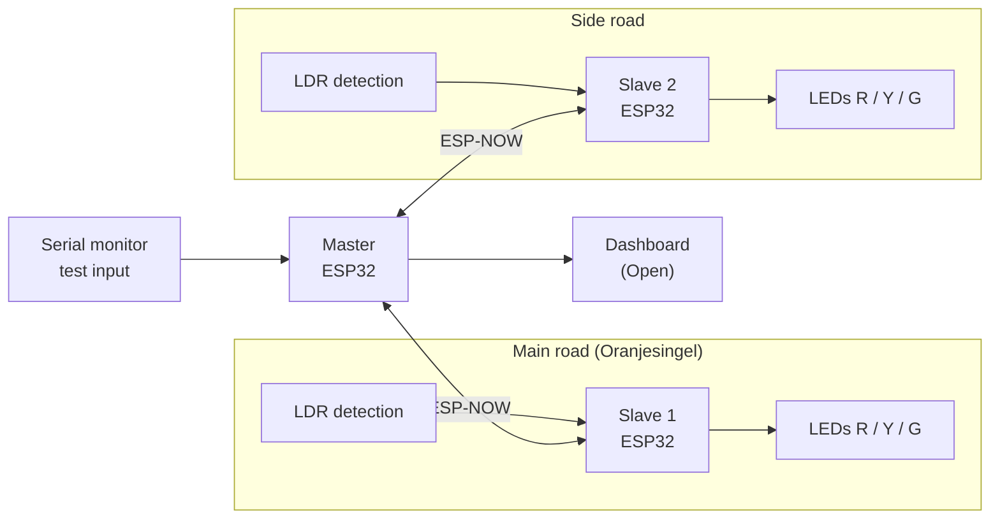
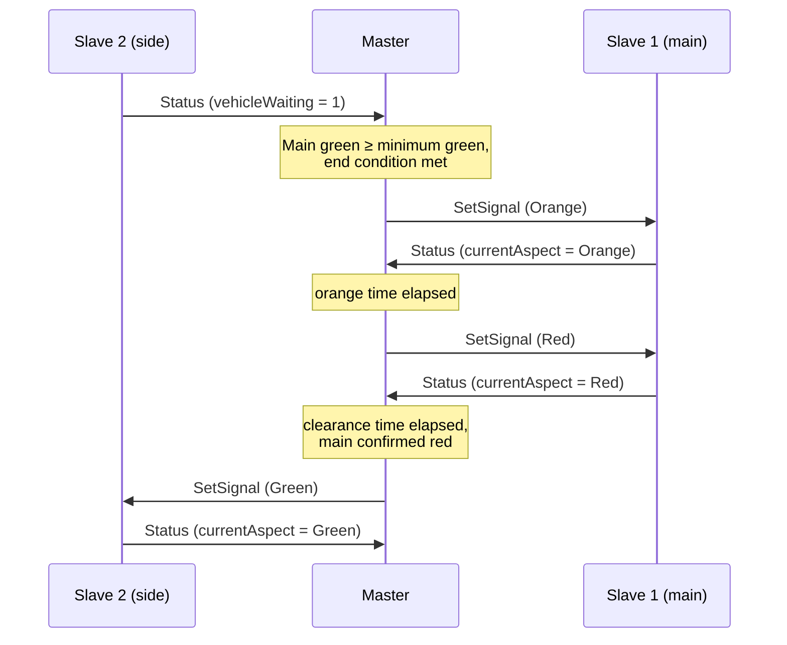
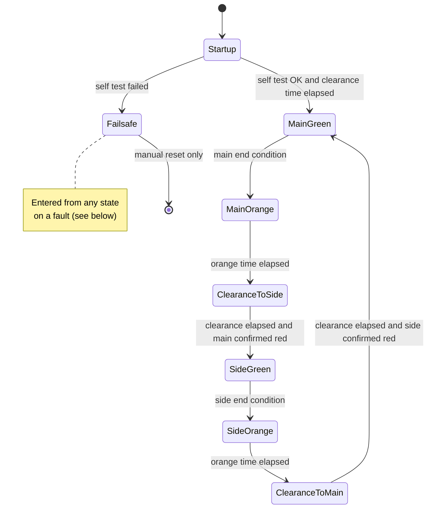

# Technical Design

How the smart traffic control prototype is built. What the system does is described in
[`functional-design.md`](functional-design.md); this document explains how the
architecture, communication, control logic and data model realise it. The reasoning
behind individual choices is recorded in [`decisions.md`](decisions.md).

> **Status: draft.** Sections and values marked **Proposed** are a starting point for
> discussion. Items marked **Open** still need a team decision and are collected in
> [section 9](#9-open-decisions).

---

## Contents

1. [Architecture](#1-architecture)
2. [Hardware](#2-hardware)
3. [Communication (ESP-NOW)](#3-communication-esp-now)
4. [Control logic: state machine](#4-control-logic-state-machine)
5. [Data model](#5-data-model)
6. [Dashboard](#6-dashboard)
7. [Test input](#7-test-input)
8. [Code structure](#8-code-structure)
9. [Open decisions](#9-open-decisions)

---

## 1. Architecture

The prototype consists of one master and two slaves, all ESP32 boards, communicating
wirelessly over ESP-NOW.



### Responsibilities

| Component | Responsible for | Not responsible for |
|---|---|---|
| **Master** | State machine, all timing decisions, processing detection and priority requests, fault detection, logging, feeding the dashboard | Driving LEDs or reading sensors directly |
| **Slave** | Switching its own LEDs to the aspect the master commands, reading its LDR(s), reporting status to the master, falling back to flashing yellow when the master is lost | Any decision about when a light changes |

### Design principles

- **One decision-maker.** Only the master decides which direction is green. Two
  conflicting greens would require the master itself to command them, which the state
  machine makes structurally impossible (BR-01).
- **Slaves fail safe on their own.** A slave that loses contact with the master does
  not keep showing its last aspect; it switches to flashing yellow by itself (BR-05).
  This matters because a crashed master can no longer command anything.
- **One source of truth for timing.** All timing parameters from the functional design
  live in one configuration header, never as literals in the logic.
- **One shared protocol definition.** Master and slave include the same message
  definitions, so both sides can never disagree about the message layout.

---

## 2. Hardware

### Boards

MAC addresses are read with the `mac_address` sketch and stored in
[`lib/VriConfig/VriConfig.h`](../lib/VriConfig/VriConfig.h). The roles follow the
[wiring check](wiring-check.md) of 2026-10-08.

| Board | Role | MAC address |
|---|---|---|
| ESP32 | Master | `94:B9:7E:DA:E2:14` |
| ESP32 | Slave 1, main road | `94:B9:7E:D9:E3:D4` |
| ESP32 | Slave 2, side road | `7C:9E:BD:65:72:FC` |

**Unconfirmed:** the roles still have to be checked against the stickers on the boards.
The board previously listed as the main road slave (`94:B9:7E:C4:98:68`) is no longer
part of the setup.

Because ESP-NOW is an ESP32 feature, both slaves must be ESP32 boards. An Arduino Uno
or Nano cannot act as a slave in this design.

Both slaves run the same firmware. At start-up a slave reads its own station MAC
address, compares it with the slave MACs in `VriConfig.h` and takes the matching pin
table. A board with an unknown MAC keeps all LEDs off and prints an error on the serial
monitor.

### Components per slave

| Component | Quantity | Represents |
|---|---|---|
| LED red / orange / green + 220 Ω resistor | 4 sets | Four signal heads (A left, A right, B left, B right) |
| LDR + 10 kΩ resistor (voltage divider) | 1 (**Open**: 2 for queue length, US-05) | Vehicle detection |

### Pin mapping

The LED pins below were checked on the intersection (see the
[wiring check](wiring-check.md)) and are the pin tables `MAIN_ROAD_PINS` and
`SIDE_ROAD_PINS` in `VriConfig.h`. Pin HIGH = LED on.

**Main road (slave 1)**

| Signal head | Red | Orange | Green |
|---|---|---|---|
| A left | 18 | 13 | 14 |
| A right | 19 | 21 | 22 |
| B left | 27 | 32 | 26 |
| B right | 25 | 33 | 23 |

**Side road (slave 2)**

| Signal head | Red | Orange | Green |
|---|---|---|---|
| A left | 32 (unconfirmed) | 33 | 27 |
| A right | 14 | 13 (unconfirmed) | 26 |
| B left | 25 | 23 | 22 |
| B right | 21 | 18 | 19 |

"Unconfirmed" LEDs did not light up visibly during the check; they are the only pins
left for those LEDs. The LDR pins are not wired yet:

| Signal | Slave GPIO | Status |
|---|---|---|
| LDR stop line | 34 | Proposed. ADC1, input only |
| LDR queue (optional) | 35 | Proposed. ADC1, input only |

The master has no inputs of its own in the current setup. The test setup contains no
physical emergency button; emergency requests are given through the serial monitor
(section 7). A button can be added later without changing the control logic, because
both sources set the same emergency request flag.

Two hardware constraints drive this mapping:

- **LDRs must use ADC1 pins (GPIO 32–39).** ADC2 cannot be read while the Wi-Fi radio is
  active, and ESP-NOW uses that radio. GPIO 32 and 33 already drive LEDs, which leaves
  GPIO 34, 35, 36 and 39.
- **Avoid strapping and flash pins** (GPIO 0, 2, 5, 12, 15 and 6–11) for LEDs, so the
  boards boot reliably regardless of what is connected.

### Signal head numbering

Every pole of the intersection carries a number: the `SignalHeadId` order in
`VriProtocol.h` plus one. The numbers were put on the poles on 2026-10-09 (see the
[wiring check](wiring-check.md#pole-numbering)).

| No. | `SignalHeadId` | Slave |
|---|---|---|
| 1 | `MAIN_A_LEFT` | Main road |
| 2 | `MAIN_A_RIGHT` | Main road |
| 3 | `MAIN_B_LEFT` | Main road |
| 4 | `MAIN_B_RIGHT` | Main road |
| 5 | `SIDE_A_LEFT` | Side road |
| 6 | `SIDE_A_RIGHT` | Side road |
| 7 | `SIDE_B_LEFT` | Side road |
| 8 | `SIDE_B_RIGHT` | Side road |

### Conflicts from the earlier design (unconfirmed)

An earlier design listed which signal heads may be green together. It named the two
side road approaches "right" and "left" instead of A and B, and how its signal heads map
onto the numbered poles is **unconfirmed**, so the table keeps its own names:

| Signal head (earlier design) | May be green together with |
|---|---|
| Main A left | Main A right, Main B left, Side "right" right, Side "left" right |
| Main A right | Main A left, Main B right, Side "right" right |
| Main B left | Main A left, Main B right, Side "right" right, Side "left" right |
| Main B right | Main A right, Main B left, Side "left" right |
| Side "right" left | Side "right" right, Side "left" right |
| Side "right" right | Main A left, Main A right, Main B left, Side "right" left, Side "left" right |
| Side "left" left | Side "right" right, Side "left" right |
| Side "left" right | Main A left, Main B left, Main B right, Side "right" left, Side "right" right, Side "left" left |

**Inconsistent:** Side "left" left lists Side "right" right as allowed, but Side "right"
right does not list Side "left" left. The table must be corrected, mapped onto the pole
numbers and confirmed before it is used for the conflict guard (US-18.04). The current
fixed-timing cycle does not use it.

### Vehicle detection

A vehicle placed over the LDR blocks the light and lowers the measured value. To avoid
false detections from flickering light or a hand passing over:

- **Threshold:** a vehicle is present below a calibrated threshold. The threshold is
  measured per setup at the start of a test session, because room lighting differs.
- **Hysteresis:** the "free" threshold is higher than the "occupied" threshold, so a
  value hovering around one point does not toggle.
- **Debounce:** the state only changes after it has been stable for 200 ms (Proposed).

---

## 3. Communication (ESP-NOW)

The reasoning for choosing ESP-NOW is recorded as a decision in
[`decisions.md`](decisions.md). In short: no router or network infrastructure is needed,
latency is low, and the boards address each other by their fixed MAC addresses.

### Messages

All messages are defined once in a shared library,
[`lib/VriProtocol/VriProtocol.h`](../lib/VriProtocol/VriProtocol.h), and included by
both firmwares.

#### Current message (fixed-timing prototype)

The master sends one message type, to the broadcast address, so both slaves receive the
same message. It carries the aspect of all 8 signal heads; each slave picks the entries
of its own signal heads.

```cpp
enum Aspect : uint8_t { ASPECT_OFF = 0, ASPECT_RED = 1, ASPECT_ORANGE = 2, ASPECT_GREEN = 3 };

enum SignalHeadId : uint8_t {
  MAIN_A_LEFT, MAIN_A_RIGHT, MAIN_B_LEFT, MAIN_B_RIGHT,  // main road slave
  SIDE_A_LEFT, SIDE_A_RIGHT, SIDE_B_LEFT, SIDE_B_RIGHT,  // side road slave
  SIGNAL_HEAD_COUNT
};

const uint8_t MESSAGE_MAGIC = 0x4B;  // 'K' - ignore other ESP-NOW packets

struct __attribute__((packed)) SignalMessage {
  uint8_t magic;
  uint8_t phase;                       // for debugging only
  uint8_t aspects[SIGNAL_HEAD_COUNT];  // Aspect per signal head
};
```

A slave ignores any packet whose length differs from `SignalMessage` or whose first
byte is not `MESSAGE_MAGIC`. The slaves send nothing back yet, so the master has no
delivery confirmation (US-18.03).

#### Planned messages (Proposed)

To add status reports and delivery confirmation, the protocol is planned to grow into:

```cpp
#pragma once
#include <stdint.h>

constexpr uint8_t PROTOCOL_VERSION = 1;

enum class MsgType : uint8_t {
    SetSignal = 1,   // master -> slave
    Status    = 2    // slave  -> master
};

enum class Aspect : uint8_t {
    Off            = 0,
    Red            = 1,
    Orange         = 2,
    Green          = 3,
    FlashingOrange = 4
};

struct __attribute__((packed)) MsgHeader {
    uint8_t  protocolVersion;  // rejected when it does not match
    MsgType  type;
    uint8_t  senderId;         // 0 = master, 1 = main road, 2 = side road
    uint16_t sequence;         // increments per message, detects lost messages
};

struct __attribute__((packed)) SetSignalMsg {
    MsgHeader header;
    Aspect    aspect;          // aspect the slave must show
};

struct __attribute__((packed)) StatusMsg {
    MsgHeader header;
    Aspect    currentAspect;   // aspect the slave is actually showing
    uint8_t   vehicleWaiting;  // 1 when the stop line LDR detects a vehicle
    uint8_t   queueLength;     // 0 if not measured (US-05)
};
```

### Timing and fault detection

| Rule | Value | Status |
|---|---|---|
| Master sends its message on every step change **and** repeats it every | 100 ms (`SEND_INTERVAL_MS`) | Current. Repetition doubles as a keep-alive for the slave |
| Slave receives no message from the master for | 1500 ms (`MASTER_TIMEOUT_MS`) → **local flashing orange** | Current. Slave fails safe on its own |
| Slave sends `Status` every | 100 ms, and immediately on a detection change | Proposed. Detection reaches the master quickly |
| Master receives no `Status` from a slave for | 500 ms → **Failsafe** | Proposed (BR-05) |
| `currentAspect` does not match the commanded aspect within | 300 ms → **Failsafe** | Proposed. Detects a slave that did not switch |

Before the first message from the master, a slave currently flashes orange, the same as
after a timeout. Whether it should show red instead is an open decision (section 9).

### Phase change sequence (Proposed)



The master only commands green for one direction after the other direction has
**confirmed** red. A lost message therefore delays a green phase instead of creating a
conflict.

### Wi-Fi coexistence

If the dashboard ends up using Wi-Fi on the master (section 6), ESP-NOW must run on the
same channel as the Wi-Fi connection. The channel is then fixed in `VriConfig.h` and
both slaves use it too.

---

## 4. Control logic: state machine

The control logic is a `millis()`-based state machine (DEC-01). The loop never blocks,
so detection and priority requests are processed at any moment.

### Current implementation: fixed-timing cycle

The master currently runs a fixed-timing prototype without detection. It cycles through
four phases; each phase gives green to one road in both directions (A and B):

| Phase | Green signal heads |
|---|---|
| 0 | Main road right (A + B) |
| 1 | Main road left (A + B) |
| 2 | Side road right (A + B) |
| 3 | Side road left (A + B) |

Every phase runs through three steps, and all other signal heads stay red:

| Step | Active signal heads | Duration |
|---|---|---|
| `STEP_GREEN` | Green | 7 s (`FIXED_GREEN_MS`) |
| `STEP_ORANGE` | Orange | 3 s (`ORANGE_MS`) |
| `STEP_CLEARANCE` | Red (all red) | 2 s (`CLEARANCE_MS`) |

After start-up the master holds all red for 3 s (`STARTUP_ALL_RED_MS`) and then starts
with phase 0. Every step change is logged on the serial monitor and sent to the slaves
straight away. There is no conflict guard yet (US-18.04).

The states below are the planned adaptive state machine.

### States

| State | Main road | Side road |
|---|---|---|
| `Startup` | Red | Red |
| `MainGreen` | Green | Red |
| `MainOrange` | Orange | Red |
| `ClearanceToSide` | Red | Red |
| `SideGreen` | Red | Green |
| `SideOrange` | Red | Orange |
| `ClearanceToMain` | Red | Red |
| `Failsafe` | Flashing orange | Flashing orange |

Every state maps to exactly one combination of aspects, and no state has two greens.



### End conditions

The main road rests on green: without demand on the side road, it stays green
indefinitely. This is what makes "side road only green when there is traffic" (US-04)
work.

**Main green ends** when *all* of the following are true:

1. Main green has lasted at least the minimum green time (BR-04), **and**
2. the side road has demand (a waiting vehicle or an emergency request), **and**
3. one of these reasons applies:

| Reason code | Condition | Story |
|---|---|---|
| `GapOut` | The main road is no longer busy | US-06 |
| `MaxOut` | Main green has reached the maximum green time | US-06 |
| `MaxWait` | The side road has waited the maximum waiting time | US-07 |
| `Emergency` | An emergency request for the side road is active | US-11 |

**Side green ends** when side green has lasted at least its minimum green time **and**
one of these applies: the side road is empty (`GapOut`), side green reached its maximum
while the main road has demand (`MaxOut`), or an emergency request for the main road is
active (`Emergency`).

"Busy" means a vehicle is detected, or was detected less than a gap time ago. The gap
time prevents green from ending in the short space between two vehicles. Starting value
3 s (Proposed; to be added to the functional parameters).

### Waiting time and emergency requests

- The **side road waiting timer** starts when side demand is first detected while the
  side road is red, and resets when the side road turns green.
- An **emergency request** is a flag, not a separate state. In the prototype it is set
  with the `emergency main` / `emergency side` serial command. It makes the requested
  direction count as having demand and adds the `Emergency` end condition. Minimum green,
  orange and clearance are still respected (BR-02, BR-04): the emergency vehicle gets
  green as fast as is safe, not instantly.
- Simultaneous requests from both directions are served in order of arrival.

### Failsafe triggers

The master enters `Failsafe` on any of these:

- the self test at startup fails (both slaves must send a `Status` within 3 s);
- a slave stops reporting (timeout, section 3);
- a slave reports an aspect other than the commanded one;
- a safety guard, checked every loop, finds two directions commanded green;
- the state machine reaches an unknown state (`default` branch of the `switch`).

`Failsafe` can only be left with a manual reset (pressing EN/reset on the master),
never automatically.

### Mapping to the business rules

| Rule | How the design guarantees it |
|---|---|
| BR-01 No conflicting greens | No state has two greens; green is only commanded after the other side confirmed red; safety guard every loop |
| BR-02 Orange then all-red clearance | The only path from a green state to the opposite green runs through orange and clearance states |
| BR-03 No red straight to green | Same as BR-02; transitions are only defined along the cycle |
| BR-04 Minimum green | Every end condition requires minimum green first, including emergency |
| BR-05 Fail-safe | `Failsafe` state on the master, independent timeout on the slaves |
| BR-06 Maximum waiting time | `MaxWait` end condition |

### Timing implementation

All durations are measured as `millis() - stateStartedAt`. Because this is an unsigned
subtraction, it stays correct when `millis()` overflows after about 49 days. `delay()`
is not used in `loop()` of the master or slave firmware; only `setup()` uses a short one.

All timing parameters are defined in one place, `VriConfig.h`. The fixed-timing cycle
already uses `FIXED_GREEN_MS`, `ORANGE_MS`, `CLEARANCE_MS` and `STARTUP_ALL_RED_MS`.
The adaptive logic will add the parameters from the functional design, for example:

```cpp
// lib/VriConfig/VriConfig.h
constexpr uint32_t MIN_GREEN_MAIN_MS = 10000;
constexpr uint32_t MAX_GREEN_MAIN_MS = 45000;
constexpr uint32_t MIN_GREEN_SIDE_MS =  6000;
constexpr uint32_t MAX_GREEN_SIDE_MS = 20000;
constexpr uint32_t ORANGE_MS         =  3000;
constexpr uint32_t CLEARANCE_MS      =  2000;
constexpr uint32_t GAP_TIME_MS       =  3000;
constexpr uint32_t MAX_WAIT_SIDE_MS  = 0;   // Open: to be agreed with the client (US-07)
```

---

## 5. Data model

The master records two kinds of events. Timestamps are milliseconds since boot, as the
prototype has no real-time clock.

### PhaseRecord

One record per completed green phase.

| Field | Type | Example |
|---|---|---|
| `sequence` | integer | 42 |
| `approach` | `main` / `side` | `main` |
| `startMs` | integer | 183200 |
| `durationMs` | integer | 27400 |
| `endReason` | `GapOut` / `MaxOut` / `MaxWait` / `Emergency` | `GapOut` |
| `mode` | `adaptive` / `fixed` | `adaptive` |

### VehicleRecord

One record per detection on a red light, written when that approach turns green.

| Field | Type | Example |
|---|---|---|
| `approach` | `main` / `side` | `side` |
| `arrivalMs` | integer | 190050 |
| `servedMs` | integer | 204700 |
| `waitMs` | integer | 14650 |
| `mode` | `adaptive` / `fixed` | `adaptive` |

With one LDR per approach, one record represents one detection episode rather than an
individually counted vehicle. This is a known limitation of the test setup.

### Derived metrics

The dashboard and the before/after comparison (US-16) are based on: average waiting
time per approach, maximum waiting time per approach, number of green phases, and the
distribution of end reasons. The end reasons show *why* the system behaved as it did,
which is the strongest evidence that the adaptive logic works.

### Fixed-time mode (Proposed)

For US-16 the master gets a second mode that runs a classic fixed-time cycle and ignores
detection. Both modes run on the same hardware with the same test scenarios, so the
before/after comparison only differs in the control logic. The mode is switched with a
serial command (section 7) and stored in every record.

Where records are stored depends on the dashboard choice (section 6).

---

## 6. Dashboard

**Open.** The options considered so far:

| Option | Pros | Cons |
|---|---|---|
| A. Master hosts a web page over Wi-Fi (access point + WebSocket) | No extra hardware; works anywhere | Limited memory for history; Wi-Fi and ESP-NOW must share a channel |
| B. Master streams JSON lines over USB serial to a laptop application | Simple on the ESP32; history and CSV export are easy on the laptop | Laptop must be connected during the demo |
| C. Master sends data to a server over the school network (HTTP or MQTT) | Closest to a real control room | School Wi-Fi often blocks devices; most failure points during a demo |

Whatever the choice, the master produces records in the format of section 5, so the
dashboard can change without touching the control logic.

---

## 7. Test input

Repeatable test scenarios (US-17) are driven through the serial monitor of the master.
Proposed command set:

| Command | Effect |
|---|---|
| `demand main on` / `off` | Simulates a vehicle on the main road |
| `demand side on` / `off` | Simulates a vehicle on the side road |
| `emergency main` / `side` | Simulates an emergency request |
| `scenario rush` | Continuous main demand, side demand every 15 s |
| `scenario quiet` | Occasional demand on both roads |
| `scenario side-surge` | Quiet main road, then sustained side demand |
| `mode adaptive` / `fixed` | Switches the control mode (section 5) |
| `status` | Prints the current state, timers and demand |

Simulated demand is combined with real LDR detection, so a scenario can run on the
physical setup and be repeated exactly. The scenarios themselves are specified in the
test plan.

---

## 8. Code structure

Each module lives in its own `.h`/`.cpp` pair, which shows as a separate tab in the
editor and keeps every file focused on one responsibility. `main.cpp` only wires the
modules together.

```
lib/
  VriConfig/VriConfig.h       board MAC addresses, pin tables, timing parameters
  VriProtocol/VriProtocol.h   shared ESP-NOW message definitions
src/
  master/
    main.cpp                  setup() and loop(): wires the modules together
    Controller.h / .cpp       fixed-timing cycle (later: state machine and end conditions)
    Comms.h / .cpp            ESP-NOW broadcast and resend interval
    DataLogger.h / .cpp       phase and vehicle records          (planned)
    SerialCommands.h / .cpp   test input parser                  (planned)
  slave/
    main.cpp                  setup() and loop()
    SignalHead.h / .cpp       pin table by MAC address, LED control, flashing orange
    Comms.h / .cpp            ESP-NOW receive, master timeout
    Detector.h / .cpp         LDR reading, threshold, hysteresis, debounce (planned)
  basics/
    <name>/main.cpp           practice sketches and hardware test tools, one environment each
```

Both slaves run the same firmware. Which approach a slave serves is determined by its
own MAC address at startup, so there is only one slave build environment.

### Hardware test tools

| Environment | What it does |
|---|---|
| `signal_head_test` | Walks every signal head of this slave (red, orange, green) and prints the GPIO, following the pin table |
| `all_on` | Switches all 12 slave LEDs on, to check that every LED works |
| `pin_scan` | Drives chosen pins through serial commands, to trace the wiring |
| `led_voltage` | Measures the voltage over each LED, to find a missing or reversed LED |

---

## 9. Open decisions

| # | Question | Affects |
|---|---|---|
| 1 | Which dashboard option (section 6)? | US-13, US-14, US-15 |
| 2 | Does turning into the city centre need its own signal (e.g. a turn arrow), or is it handled within the main road phase? | US-12 |
| 3 | One or two LDRs per approach (queue length)? | US-05 |
| 4 | Maximum waiting time for the side road (client agreement) | US-07 |
| 5 | Gap time value; add to the functional parameters | US-06 |
| 6 | How is time of day provided for peak and off-peak programs (NTP, serial, button)? | US-08 |
| 7 | Final pin mapping: confirm the two unconfirmed LEDs and choose the LDR pins | All hardware stories |
| 8 | Before the first message from the master, should a slave flash orange (current behaviour) or show red? | US-02 |
| 9 | Which signal heads may be green together? The conflict table in section 2 is inconsistent and not mapped onto the pole numbers | US-18.04 |

When a decision is made, it is recorded in [`decisions.md`](decisions.md) and this
document is updated.
